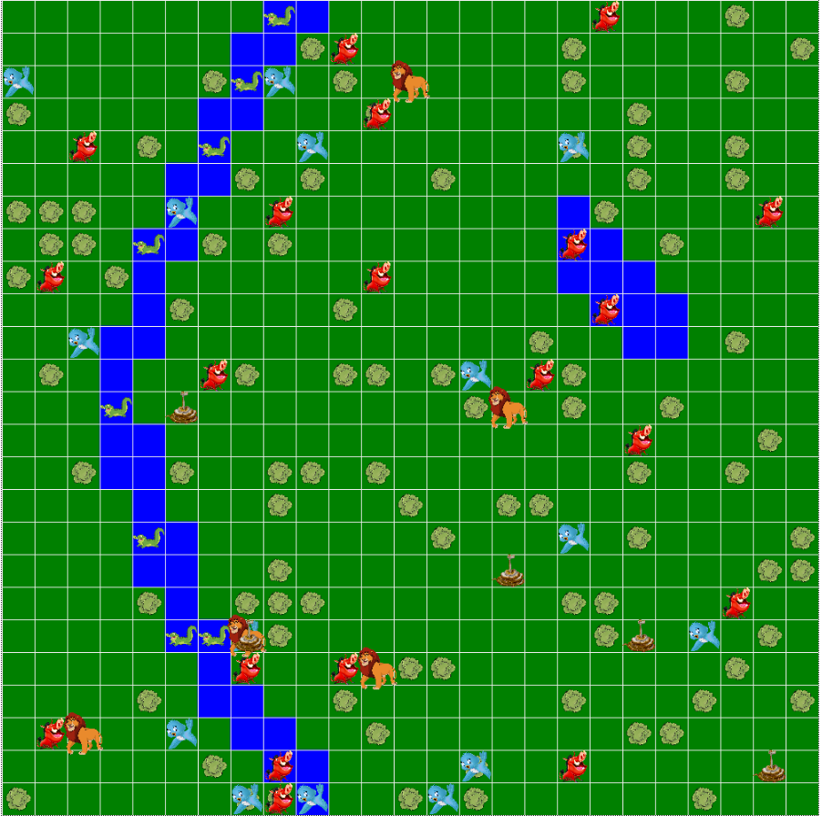

# Intelligent Ecosystem
This is an open project to learn about Artificial Inteligence BDI Agents in which we built an intelligent ecosystem.
## Purposes
We built this project as an assignment to our *Artificial Intelligent* class in college (São Paulo State University - UNESP).
## Getting Started
These instructions will get you a copy of the project up and running on your local machine for development and testing purposes.

### Prerequisites
- Python3
- numpy
- [Mesa Framework](https://github.com/projectmesa/mesa/blob/master/docs/index.rst)

### Run
Inside */app* folder run the following command:
```
python run.py 
```

## About the project
### Settings
To test different simulations you can change global variables at */app/config/variables.py* to each agent. Here is an example:
```
lion_variables = {"lion_num": 5,
				"initial_health" : 150, 
				"born_chance" : 1,
				"min_health_breeding" : 10,
				"food_refill" : 20,
				"water_refill" : 10,
				"damage_points" : 4,
				"damage_chance" : 7}
```
*The meaning of each variable is inside the code*

## Overview
This is an visualization of the ecosystem:

As you can see in the picture above there are 5 species as animal agents: Antelope, Bird, Crocodile, Lion and Snake. The other elements, like Bush, Jungle and Water were considered as agents too, so the animal agents can interact with them.
Each animal agent has their own beliefs, desires and intentions.
##### Among the agents' beliefs are:
- Environment:
    - Location of land types
    - Location of objects and each terrain in their field of perception
    - Perception of the gender and species of agents in their field of perception
- Internal States:
    - Current osition
    - Amount of life (Heath points)
    - Gender
    - Species
    - Type of agent
##### Among the desires of the agents are:
- Maintain a high standard of living
- Explore the environment
- Reproduction of the species so that extinction does not occur
##### Among the intentions of the agents are:
- Eating
- Drinking
- Escape from predatory species
- Chase prey
- Reproduce the species
- Sow (bird only)
### Specific Behaviors
All the animal agents have a chance to lose health points in each step. When their health point reach 0, the agent will die.
The Water resource is infinite.
All animal agents can reproduce with the same specie and the opposite gender.
##### Antelope Agent:
- Eats Bush and drinks water
- Flees from Lion
##### Bird Agent:
- Eats Bush (but not consume its resources), gaining a seed, and drinks water 
- Sow Bush seed after 10 steps when the Bird carries it
- Flees from Snake
##### Crocodile Agent:
- Eats Antelope, Bird, Snake and drinks water
- Does not flee from anyone, but can only walks in the Water and its margin
##### Lion Agent:
- Eats Antelope, Crocodile, Snake and drinks water
- Does not flee from anyone, but can not walk in the Water
##### Snake Agent:
- Eats Bird and drinks water
- Flees from Crocodile and Lion
